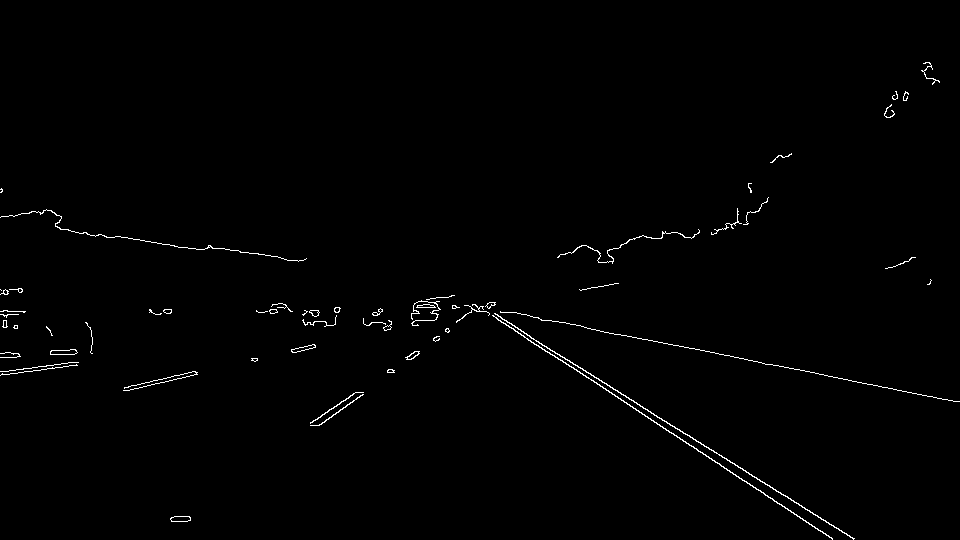
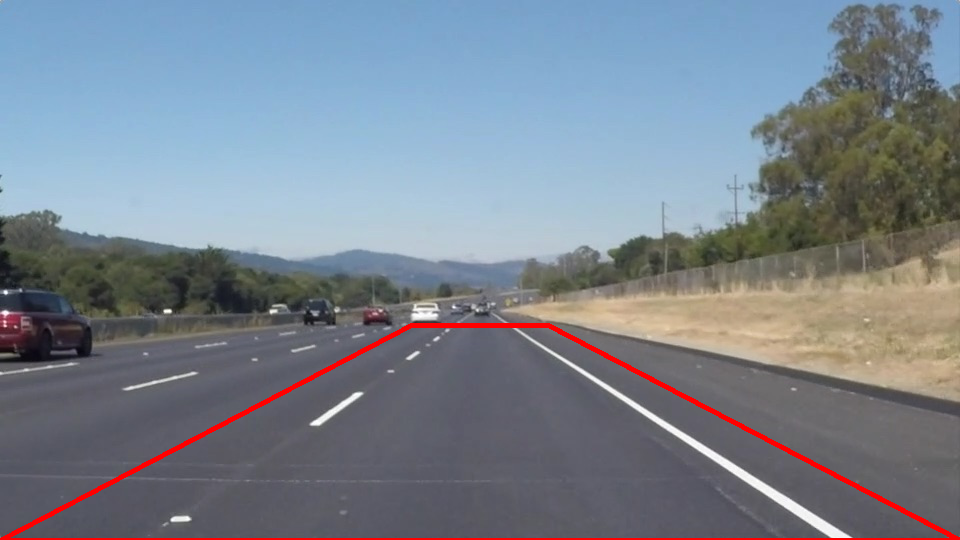
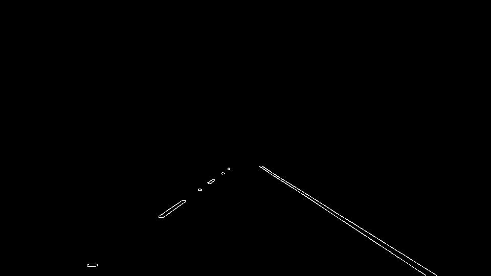
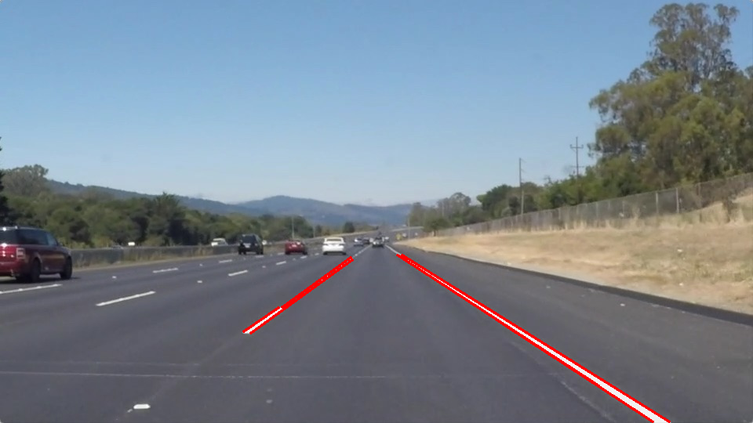

# **Finding Lane Lines on the Road** 


## Writeup template

---

### Results

With the implemented pipeline, the lanes in the two provided clips have been reliably detected.


---


### Pipeline overview 

My pipeline consists of the following steps:

* Step 1 - Load color image
* Step 2 - Convert into grayscale image
* Step 3 - Apply blur filter
* Step 4 - Apply canny edge detection
* Step 5 - Select region of interest
* Step 6 - Find lines using hough transform
* Step 7 - Separate lines into left and right, average and extrapolate them

---

### Pipeline details


#### Step 1 - Load color image

First, the image is read with the `mpimg.imread()` function.


#### Step 2 - Convert image into grayscale image

The original image is converted into grayscale with the `cv2.cvtColor(img, cv2.COLOR_RGB2GRAY)` function.


#### Step 3 - Apply blur filter

The image is blurred with the `cv2.GaussianBlur(img, (kernel_size, kernel_size), 0)` function to remove noise for a better canny edge performance. 


#### Step 4 - Apply canny edge detection

For canny edge detection the `cv2.Canny(img, low_threshold, high_threshold)` function is applied. The threshold values are determined according to the recommendation in the lecture (low:high threshold ratio of 1:2 or 1:3 in range of tens to hundreds).




#### Step 5 - Select region of interest

The region of interest is determined by the shape of the lanes in the images. The function `cv2.fillPoly(mask, vertices, ignore_mask_color)` sets the color in the region of interest to white. Finally the mask is used by `cv2.bitwise_and(img, mask)` to keep only the specified region of the image.





#### Step 6 - Find lines using hough transform

For finding lines, the probabilistic hough transform function `cv2.HoughLinesP(img, rho, theta, threshold, np.array([]), minLineLength=min_line_len, maxLineGap=max_line_gap)` is used. This function returns the extremes of the detected lines (instead of $\theta$ and $\rho$ using the standard hough transform function `cv2.HoughLines()`)[OpenCV Documentation](https://docs.opencv.org/3.0-beta/doc/py_tutorials/py_imgproc/py_houghlines/py_houghlines.html). The relevant parameters are set by trial and error. 



#### Step 7 - Separate lines into left and right, average and extrapolate them

The function `avg_extrapol(lines)` draws one single line on the left and one on the right lane. It works as follows:
* Left and right lines are separated by their slope
* Slopes and offsets are averaged respectively
* The extremes of the two resulting lines are returned


#### Imported modules

```
import matplotlib.pyplot as plt
import matplotlib.image as mpimg
import numpy as np
import cv2
import os
from moviepy.editor import VideoFileClip
from IPython.display import HTML
```

---

### Shortcomings with current pipeline

* Only straight lines are detected with the applied hough transform -> curved lanes cannot be detected as curves
* Only intensity is considered using grayscale images -> colored lines are not detected under challenging light conditions
* Lines are jittering (not smooth over time)

---

### Possible pipeline improvements

* Use of higher degree polynomials for lane fitting to detect curves
* Use of a different color space for better performance (e.g. better detection of yellow lines)
* Use of lane history for smoother lanes and avoidance of frames without detected lines
* Improved parametrization (with a GUI for example)


